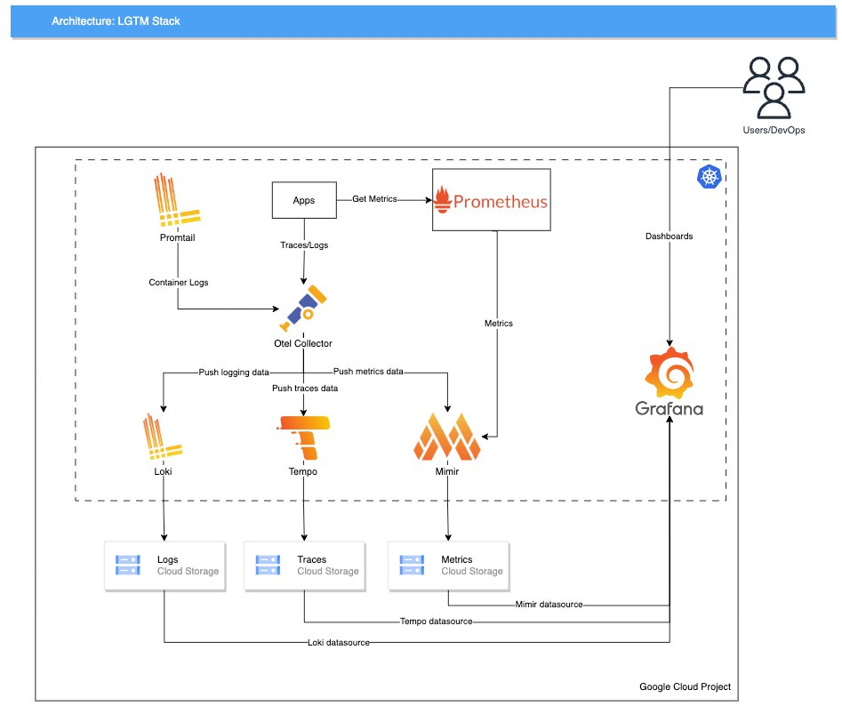

<br>

<div align="center">
    <a href="README.md">🇺🇸 English</a> | <a href="README.pt-br.md">🇧🇷 Português (Brasil)</a>
</div>
<br>

# 🔍 LGTM Stack for Kubernetes

## Introduction

The LGTM stack, by Grafana Labs, combines best-in-class open-source tools to provide comprehensive system visibility, consisting of:

- **Loki**: Log aggregation system https://grafana.com/oss/loki/
- **Grafana**: Interface & Dashboards https://grafana.com/oss/grafana/
- **Tempo**: Distributed tracing storage and management https://grafana.com/oss/tempo/
- **Mimir**: Long-term metrics storage for Prometheus https://grafana.com/oss/mimir/


With this stack, we have a complete observability solution that covers logs, metrics, and traces, with support for high availability and scalability, plus all data will be present in a single location (grafana), making it easier to analyze and correlate events, and by using object storage as a backend, the solution becomes much more economical compared to others that require dedicated databases or persistent disks.

### Architecture



Each component (Loki, Grafana, Tempo, Mimir) runs in Kubernetes with its own storage backend. For instance we are using GCP Cloud Storage as example, but the stack supports AWS (s3)/Azure (blob storage) as backends too, for local development we can use MinIO.

Also this architecture includes four optional components:
- Prometheus: collects custom metrics from apps and cluster and sends to Mimir
- Kube-state-metrics: collects metrics (CPU/Memory) of services/apps through the API server and outputs to Prometheus
- Promtail: agent that captures container logs and sends to Loki
- OpenTelemetry Collector: routes all telemetry data to appropriate backends, acts as a central hub

### Hardware Requirements

Local development:
- 2-4 CPUs
- 8 GB RAM
- 50 GB disk space

Production setup:
- Can vary a lot depending on the amount of data and traffic, it's recommended to start with a small setup and scale as needed, for small-mid environments the following is recommended (minimum):
  - 8 CPUs
  - 24 GB RAM
  - 100 GB disk space (SSD, don't count for storage backends)

## Summary

- [Introduction](#introduction)
  - [Architecture](#architecture)
  - [Hardware Requirements](#hardware-requirements)
- [Getting Started](#-getting-started)
  - [Prerequisites](#-prerequisites)
  - [Installation](#installation)
    - [Option 1: Makefile](#option-1-makefile)
    - [Option 2: Manual Installation](#option-2-manual-installation)
      - [Setup](#setup)
      - [Choose Your Environment](#choose-your-environment)
        - [Local Development](#local-development-k3s-minikube)
        - [GCP Production Setup](#gcp-production-setup)
- [Install Dependencies](#install-dependencies)
- [Testing](#testing)
  - [Access Grafana](#access-grafana)
  - [Sending Data](#sending-data)
    - [Loki (Logs)](#loki-logs)
    - [Tempo (Traces)](#tempo-traces)
    - [Mimir (Metrics)](#mimir-metrics)
- [OpenTelemetry](#opentelemetry)
  - [OpenTelemetry Collector](#opentelemetry-collector)
  - [Flask App Integration](#flask-app-integration)
  - [Testing the Integration](#testing-the-integration)
  - [Extra Configuration](#extra-configuration)
    - [Loki Labels Customization](#loki-labels-customization)
- [Uninstall](#uninstall)

## 🚀 Getting Started

### ✨ Prerequisites
- [Helm v3+](https://helm.sh/docs/intro/install/)
- [kubectl](https://kubernetes.io/docs/tasks/tools/)
  - For local testing: [k3s](https://k3s.io/) or [minikube](https://minikube.sigs.k8s.io/docs/start/) kubernetes cluster configured
- For GCP: [gcloud CLI](https://cloud.google.com/sdk/docs/install)

> **Note**: This guide uses the official [lgtm-distributed](https://artifacthub.io/packages/helm/grafana/lgtm-distributed) Helm chart from Grafana Labs for deployment.

### Installation

### Option 1: Makefile

To simplify the installation process, you can use the Makefile commands:

```bash
# Clone repository
git clone git@github.com:daviaraujocc/lgtm-stack.git
cd lgtm-stack
make install-local # For local testing, for using GCP cloud storage use make install-gcp and set PROJECT_ID
```

This will install the LGTM stack with the default configuration for local development with the dependencies (promtail, dashboards, prometheus). If you want to customize the installation, you can edit the `helm/values-lgtm.local.yaml` file.

### Option 2: Manual Installation

### Setup
```bash
# Clone repository
git clone git@github.com:daviaraujocc/lgtm-stack.git
cd lgtm-stack

# Add repositories & create namespace
helm repo add prometheus-community https://prometheus-community.github.io/helm-charts
helm repo add grafana https://grafana.github.io/helm-charts
helm repo update
kubectl create ns monitoring

# Install prometheus operator for metrics collection and CRDs
helm install prometheus-operator --version 66.3.1 -n monitoring \
  prometheus-community/kube-prometheus-stack -f helm/values-prometheus.yaml
```

### Choose Your Environment

#### Local Development (k3s, minikube)

For local testing and development scenarios. Uses local storage via MinIO.

```bash
helm install lgtm --version 2.1.0 -n monitoring \
  grafana/lgtm-distributed -f helm/values-lgtm.local.yaml
```

#### GCP Production Setup

For production environments, using GCP resources for storage and monitoring.

1. Set up GCP resources:

```bash
# Set your project ID
export PROJECT_ID=your-project-id

# Create buckets with random suffix
export BUCKET_SUFFIX=$(openssl rand -hex 4 | tr -d "\n")
for bucket in logs traces metrics metrics-admin; do
  gsutil mb -p ${PROJECT_ID} -c standard -l us-east1 gs://lgtm-${bucket}-${BUCKET_SUFFIX}
done

# Update bucket names in config
sed -i -E "s/(bucket_name:\s*lgtm-[^[:space:]]+)/\1-${BUCKET_SUFFIX}/g" helm/values-lgtm.gcp.yaml

# Create and configure service account
gcloud iam service-accounts create lgtm-monitoring \
    --display-name "LGTM Monitoring" \
    --project ${PROJECT_ID}

# Set permissions
for bucket in logs traces metrics metrics-admin; do 
  gsutil iam ch serviceAccount:lgtm-monitoring@${PROJECT_ID}.iam.gserviceaccount.com:admin \
    gs://lgtm-${bucket}-${BUCKET_SUFFIX}
done

# Create service account key and secret
gcloud iam service-accounts keys create key.json \
    --iam-account lgtm-monitoring@${PROJECT_ID}.iam.gserviceaccount.com
kubectl create secret generic lgtm-sa --from-file=key.json -n monitoring
```

2. Install LGTM stack:


You can change values in `helm/values-lgtm.gcp.yaml` to fit your environment if you want like ingress for grafana, etc.

```bash
helm install lgtm --version 2.1.0 -n monitoring \
  grafana/lgtm-distributed -f helm/values-lgtm.gcp.yaml
```

## Install dependencies 


```bash
# Install Promtail for collecting container logs
# Check if you are using Docker or CRI-O runtime
## Docker runtime
kubectl apply -f manifests/promtail.docker.yaml
## CRI-O runtime 
## kubectl apply -f manifests/promtail.cri.yaml

# Install kubernetes dashboards for grafana
kubectl apply -f manifests/kubernetes-dashboards.yaml
```


## Testing

After installation you can check components by running:

```bash
# Check if all pods are running
kubectl get pods -n monitoring

# To check logs

# Loki
kubectl logs -l app.kubernetes.io/name=loki -n monitoring

# Tempo
kubectl logs -l app.kubernetes.io/name=tempo -n monitoring

# Mimir
kubectl logs -l app.kubernetes.io/name=mimir -n monitoring
```

Follow the steps below to test each component:

### Access Grafana
```bash
# Access dashboard
kubectl port-forward svc/lgtm-grafana 3000:80 -n monitoring

# Get password credentials
kubectl get secret --namespace monitoring lgtm-grafana -o jsonpath="{.data.admin-password}" | base64 --decode
```
- Default username: `admin`
- Access URL: http://localhost:3000
- Check default Grafana dashboards and Explore tab

### Sending Data

After installation, verify each component is working correctly:

#### Loki (Logs)
Test log ingestion and querying:

```bash
# Forward Loki port
kubectl port-forward svc/lgtm-loki-distributor 3100:3100 -n monitoring

# Send test log with timestamp and labels
curl -XPOST http://localhost:3100/loki/api/v1/push -H "Content-Type: application/json" -d '{
  "streams": [{
    "stream": { "app": "test", "level": "info" },
    "values": [[ "'$(date +%s)000000000'", "Test log message" ]]
  }]
}'
```

To verify:
1. Open Grafana (http://localhost:3000)
2. Go to Explore > Select Loki datasource
3. Query using labels: `{app="test", level="info"}`
4. You should see your test message in the results


If you have installed promtail you can check the container logs also on Explore tab.

#### Tempo (Traces)

Since Tempo is compatible with the OpenTelemetry OTLP protocol, we will use the Jaeger Trace Generator, a tool that generates example traces and sends the data using OTLP.

```bash
# Forward Tempo port
kubectl port-forward svc/lgtm-tempo-distributor 4318:4318 -n monitoring

# Generate sample traces with service name 'test'
docker run --add-host=host.docker.internal:host-gateway --env=OTEL_EXPORTER_OTLP_ENDPOINT=http://host.docker.internal:4318 jaegertracing/jaeger-tracegen -service test -traces 10
```

To verify:
1. Go to Explore > Select Tempo datasource
2. Search by Service Name: 'test'
3. You should see 10 traces with different spans

#### Mimir (Metrics)

Since we have a Prometheus instance running inside the cluster sending basic metrics (CPU/Memory) to Mimir, you can already check the metrics in Grafana:

1. Access Grafana
2. Go to Explore > Select Mimir datasource
3. Try these example queries:
   - `rate(container_cpu_usage_seconds_total[5m])` - CPU usage
   - `container_memory_usage_bytes` - Container memory usage

You can also push custom metrics to Mimir using Prometheus Pushgateway, to endpoint `http://lgtm-mimir-nginx.monitoring:80/api/v1/push`.


## OpenTelemetry

OpenTelemetry is a set of APIs, libraries, agents, and instrumentation to provide observability for cloud-native software. It consists of three main components:

- **OpenTelemetry SDK**: Libraries for instrumenting applications to collect telemetry data (traces, metrics, logs).
- **OpenTelemetry Collector**: A vendor-agnostic agent that collects, processes, and exports telemetry data to backends.
- **OpenTelemetry Protocol (OTLP)**: A standard for telemetry data exchange between applications and backends.

In this setup, we will use the OpenTelemetry Collector to route telemetry data to the appropriate backends (Loki, Tempo, Mimir).

### OpenTelemetry Collector

To install the OpenTelemetry Collector:

```bash
# Install OpenTelemetry Collector
kubectl apply -f manifests/otel-collector.yaml
```

Check if the collector is up and running:

```bash
kubectl get pods -l app=otel-collector
kubectl logs -l app=otel-collector
```

### Flask App Integration

We'll use a pre-instrumented Flask application (source code at `flask-app/`) that generates traces, metrics, and logs using OpenTelemetry.

The application exposes an endpoint `/random` that returns random numbers and generates telemetry data. The default endpoint used for sending telemetry data will be `http://otel-collector:4318`.


1. Deploy the sample application:
```bash
# Deploy sample app
kubectl apply -f manifests/app/flask-app.yaml
```

2. Verify application deployment:
```bash
kubectl get pods -l app=flask-app 
kubectl get svc flask-app-service 
```

3. Apply PodMonitor for metrics scraping:
```bash
kubectl apply -f manifests/app/podmonitor.yaml
```

### Testing the integration

1. Generate traffic to the application:
```bash
# Get the application URL
# Port-forward the application
kubectl port-forward svc/flask-app 8000:8000 -n monitoring

# Send requests to generate telemetry data
for i in {1..50}; do
  curl http://localhost:8000/random
  sleep 0.5
done
```

2. Check the generated telemetry data in Grafana:

**Traces (Tempo):**

1. Go to Explore > Select Tempo datasource

2. Search for Service Name: flask-app

3. You should see traces with GET /random operations

**Metrics (Mimir):**

1. Go to Explore > Select Mimir datasource

2. Try these queries:
```promql
# Total requests count
rate(request_count_total[5m])
```

**Logs (Loki):**

1. Go to Explore > Select Loki datasource

2. Query using labels:

```logql
{job="flask-app"}
```
You should see structured logs from the application.

#### Extra Configuration

##### Loki Labels Customization

In case you have new labels you want to add to logs in Loki through the OpenTelemetry Collector, you need to perform the following configuration:

1. Edit the ConfigMap `otel-collector-config`
2. Locate the `processors.attributes/loki` section
3. Add your custom labels to the `loki.attribute.labels` list:

```yaml
processors:
  attributes/loki:
    actions:
      - action: insert
        key: loki.format
        value: raw
      - action: insert
        key: loki.attribute.labels
        value: facility, level, source, host, app, namespace, pod, container, job, your_label
```

> After modifying the ConfigMap, restart the collector pod to apply the changes:
> ```bash
> kubectl rollout restart daemonset/otel-collector -n monitoring
> ```

## Uninstall

```bash
# Using Makefile
make uninstall

# or manual

# Remove LGTM stack
helm uninstall lgtm -n monitoring

# Remove prometheus operator 
helm uninstall prometheus-operator -n monitoring

# Remove namespace
kubectl delete ns monitoring

# Remove promtail & otel-collector 
kubectl delete -f manifests/promtail.yaml
kubectl delete -f manifests/otel-collector.yaml

# For GCP setup, cleanup:
for bucket in logs traces metrics metrics-admin; do
  gsutil rm -r gs://lgtm-${bucket}-${BUCKET_SUFFIX}
done

gcloud iam service-accounts delete lgtm-monitoring@${PROJECT_ID}.iam.gserviceaccount.com
```